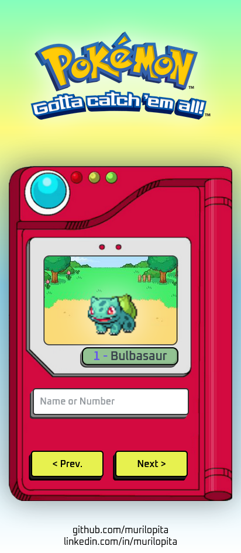

<h1 align="center" >
   
  
   
</h1>

<strong>
Plataforma de Busca e listagem de pokémons
</strong>

 

O desafio de projeto tinha como finalidade criar um site 100% responsivo e com a listagem de todos os pokémons.

Todos os dados sobre os pokémons como nome, número, tipo e imagem, foram possíveis com o uso da API REST [PokéApi](https://pokeapi.co/).

Na minha pokedex você consegue buscar qualquer pokemon através do número ou do nome do pokemon. Caso queira verificar na ordem, voce pode usar os botões de Next ou Prev.

 

# Deploy

Você pode conferir o site clicando [aqui]().

 

<h1 align="center">
    Desktop Version
     
     
    
</h1>

<h1 align="center">
    Mobile Version
         
     
    
</h1>